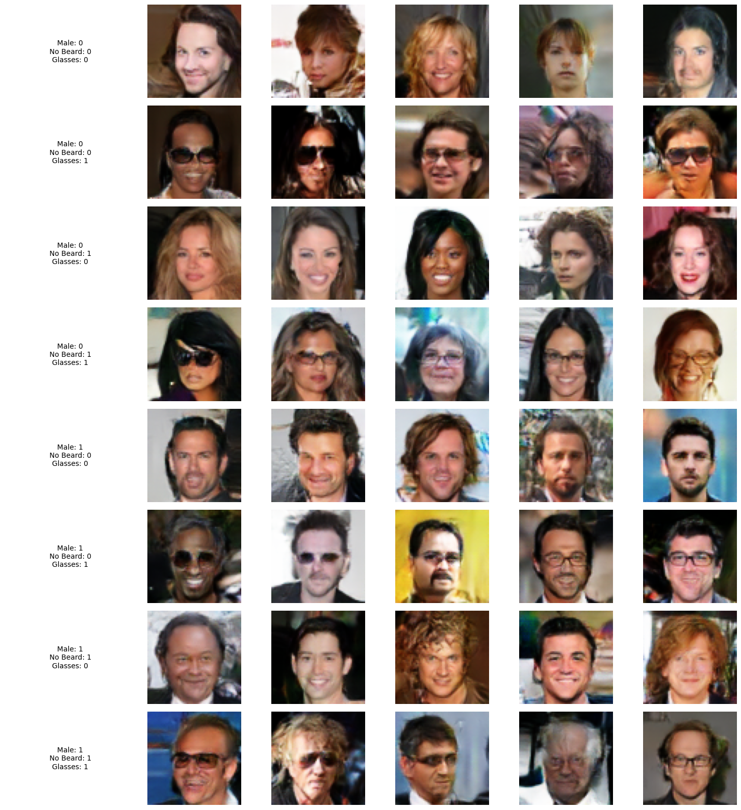
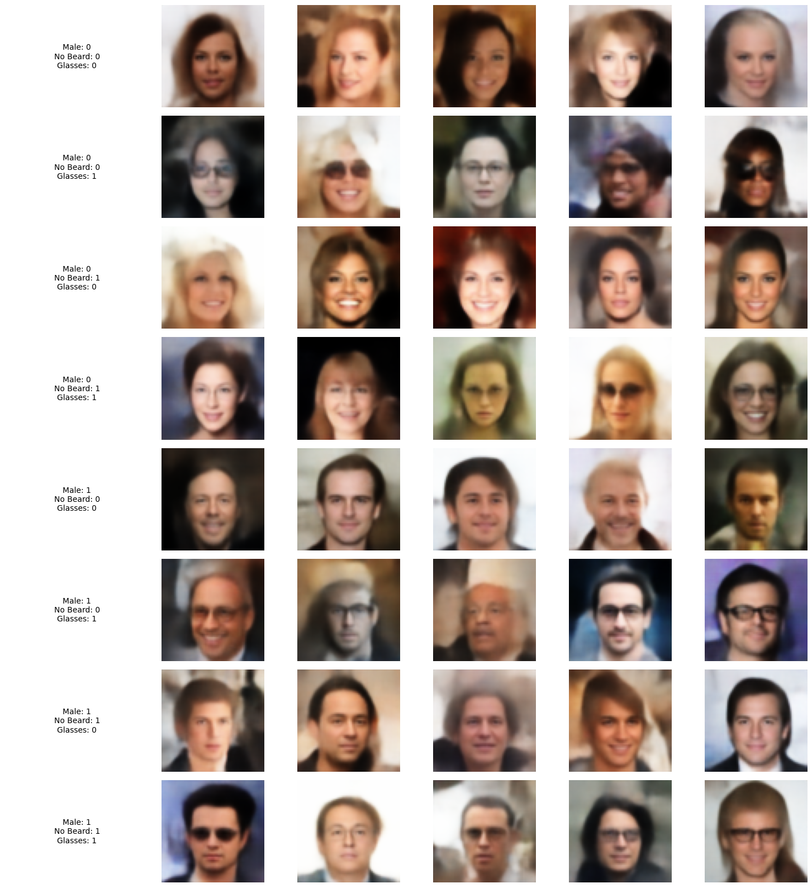
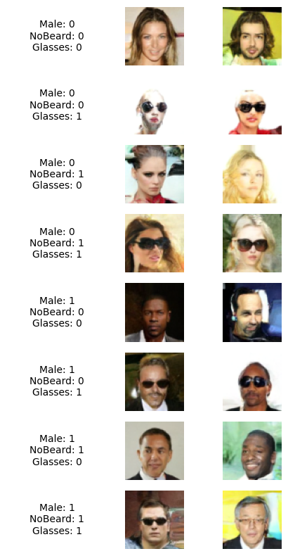

# Generative AI for Human Face Generation

This repository contains the implementation, training, and inference code for three conditional generative models tailored for human face generation. The project was developed as part of a university course on Generative Artificial Intelligence, extending unconditional base algorithms to include conditional attributes.





## Overview

The goal of this project is to model the distribution of human face images using the CelebA dataset and conditionally generate outputs based on specific attributes. The three models implemented are:
- Conditional Variational Autoencoder (CVAE)
- Conditional Generative Adversarial Network (CGAN)
- Denoising Diffusion Probabilistic Model (DDPM)

The models are specifically trained to condition on the following three attributes:
- **Gender** (Male/Female)
- **Beard** (Presence/Absence)
- **Glasses** (Presence/Absence)

## Repository Structure

- `src/`: Contains the core architecture and training scripts for the three models.
  - `cvae.py`: Implementation of the Conditional VAE.
  - `cgan.py`: Implementation of the Conditional GAN.
  - `ddpm.py`: Implementation of the DDPM and U-Net architecture.
- `notebooks/`: Jupyter Notebooks demonstrating inference and generation processes for each trained model.
  - `test_cvae.ipynb`
  - `test_cgan.ipynb`
  - `test_ddpm.ipynb`
- `weights/`: Directory reserved for trained model checkpoints used during inference.

## Setup and Installation

### Prerequisites

- Python 3.8 or higher
- PyTorch and Torchvision
- Matplotlib, Numpy

You can install the dependencies via pip:
```bash
pip install torch torchvision matplotlib numpy
```

### Dataset Configuration

The models require the CelebA dataset for training. By default, the code looks for a configured environment variable or a local directory. To configure the dataset path, set the following environment variable before running the scripts:

```bash
export CELEBA_PATH="/path/to/your/custom/celeba/directory"
```

If not set, it defaults to `./data/celeba`.

## Usage

### Training

To train the models from scratch, you can run the respective python scripts located in the `src/` directory.

```bash
python src/cvae.py
python src/cgan.py
python src/ddpm.py
```
Checkpoints are configured to be saved inside `checkpoints/` and final weights are dumped in `final_weights/`. Ensure these directories exist or modify the scripts appropriately.

### Inference

Once the models are trained or pre-trained weights are placed in the `weights/` directory (e.g., `weights/cvae.pth`), you can generate new images by utilizing the Jupyter notebooks in the `notebooks/` directory.

1. Open `notebooks/test_cvae.ipynb` (or the others) in Jupyter.
2. Execute the cells to load the models.
3. Use the generation interface to produce customized human faces by modifying the condition toggles (gender, beard, glasses).

## Security Note

For production environments, when loading pre-trained weights using `torch.load()`, it is best to set `weights_only=True` to mitigate the execution of arbitrary unpickled code unless the files are fully trusted. The notebooks contain adjustments for this security consideration.

## License

This project is licensed under the MIT License - see the LICENSE file for details.
